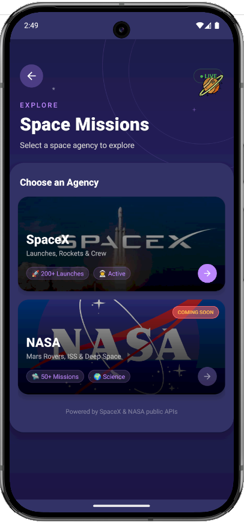
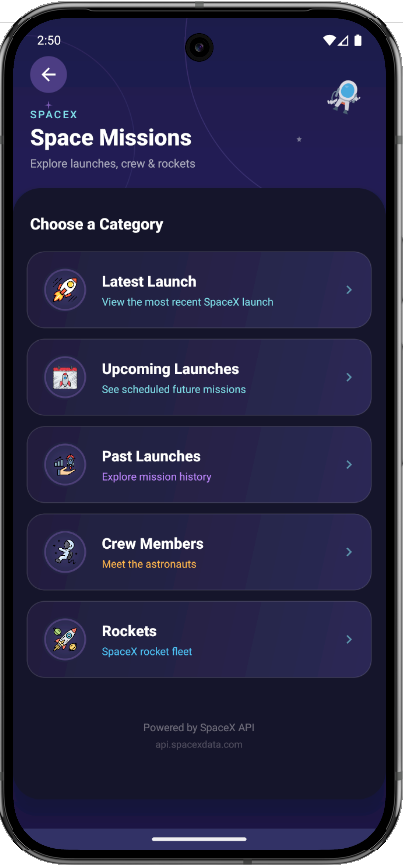
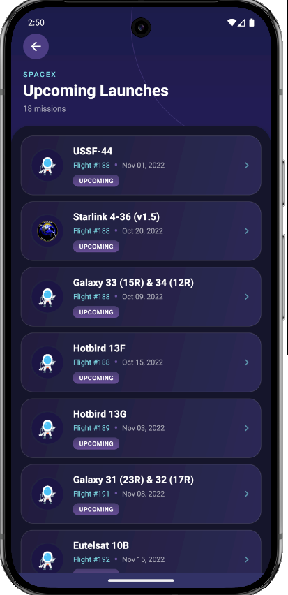
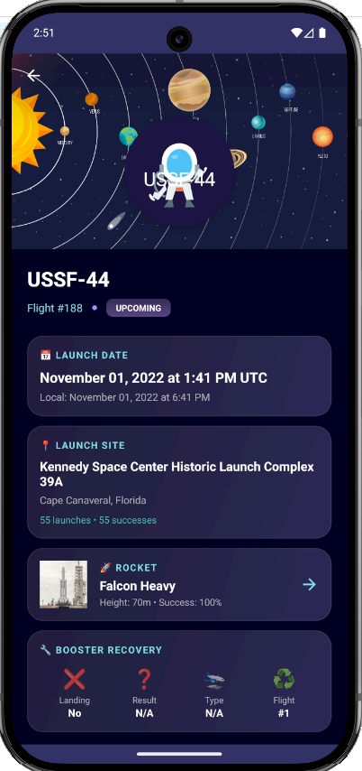
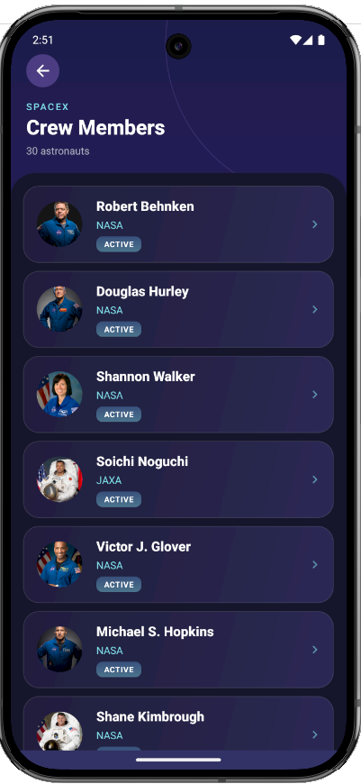

<div align="center">

# 🪐 Planetoo


### *Your Gateway to the Universe*

[](https://developer.android.com)
[](https://kotlinlang.org)
[](https://android-arsenal.com/api?level=21)
[](LICENSE)

[](https://github.com/r-spacex/SpaceX-API)
[](https://nasa.gov)

---

**Planetoo** is a stunning, feature-rich Android app that brings the wonders of space exploration to your fingertips. Explore planets, discover moons, track SpaceX missions, and journey through the cosmos with beautiful animations and real-time data.

[Features](#-features) • [Screenshots](#-screenshots) • [Tech Stack](#%EF%B8%8F-tech-stack) • [Installation](#-getting-started) • [Architecture](#-architecture)

</div>

---

## ✨ Features

<table>
<tr>
<td width="50%">

### 🪐 Solar System Explorer
- **8 Planets** with detailed information
- Diameter, gravity, atmosphere data
- Beautiful imagery and gradients
- Fun facts and educational content

### 🌙 Moon Discovery
- **200+ Natural Satellites**
- Filter by parent planet
- Real-time API data
- Orbital mechanics info

### 🚀 SpaceX Missions
- **Live Launch Tracking**
- Upcoming & past missions
- Detailed launch information
- Rocket specifications

</td>
<td width="50%">

### 👨‍🚀 Crew Database
- SpaceX astronaut profiles
- Mission assignments
- Agency information
- Wikipedia integration

### 🛸 Real-Time Data
- Solar System OpenData API
- SpaceX REST API
- Auto-refresh capabilities
- Offline caching

### 🎨 Stunning UI/UX
- Dark space theme
- Smooth animations
- Material Design 3
- Custom loading states

</td>
</tr>
</table>

---

## 📱 Screenshots

<div align="center">

### 🏠 Core Experience

<table>
<tr>
<td align="center"><b>🚀 Splash</b></td>
<td align="center"><b>🏠 Home</b></td>
<td align="center"><b>🪐 Planets</b></td>
<td align="center"><b>📋 Planet Details</b></td>
</tr>
<tr>
<td></td>
<td></td>
<td></td>
<td></td>
</tr>
</table>

### 🌙 Moons Explorer

<table>
<tr>
<td align="center"><b>🌍 Planet Select</b></td>
<td align="center"><b>🌙 Moons List</b></td>
<td align="center"><b>📖 Moon Details</b></td>
<td align="center"><b>🔍 Search</b></td>
</tr>
<tr>
<td></td>
<td></td>
<td></td>
<td></td>
</tr>
</table>

### 🚀 SpaceX Integration

<table>
<tr>
<td align="center"><b>🏢 Mission Agencies</b></td>
<td align="center"><b>📋 SpaceX Missions</b></td>
<td align="center"><b>🚀 Upcoming Launches</b></td>
<td align="center"><b>📊 Mission Details</b></td>
</tr>
<tr>
<td></td>
<td></td>
<td></td>
<td></td>
</tr>
</table>

### 👨‍🚀 Crew & More

<table>
<tr>
<td align="center"><b>👨‍🚀 Crew Members</b></td>
</tr>
<tr>
<td></td>
</tr>
</table>

</div>

---

## 🏗️ Architecture

Planetoo follows **Clean Architecture** with MVVM pattern:

```
📦 com.example.planetapp
├── 📂 data
│   ├── 📂 local              # Local data sources
│   ├── 📂 remote
│   │   ├── 📂 api            # Retrofit interfaces
│   │   │   ├── SolarSystemApi.kt
│   │   │   ├── SpaceXApi.kt
│   │   │   └── RetrofitClients
│   │   └── 📂 model
│   │       ├── 📂 spacex     # SpaceX models
│   │       └── Moon/Planet models
│   └── 📂 repository         # Repository implementations
├── 📂 domain
│   ├── 📂 model              # Domain entities
│   ├── 📂 repository         # Repository interfaces
│   └── 📂 usecase            # Business logic
├── 📂 presentation
│   ├── 📂 adapter            # RecyclerView adapters
│   ├── 📂 home               # Home screen
│   ├── 📂 planets            # Planets feature
│   ├── 📂 moons              # Moons feature
│   ├── 📂 spacex             # SpaceX feature
│   │   ├── SpaceAgencySelectionActivity
│   │   ├── SpaceMissionsActivity
│   │   ├── LaunchListActivity
│   │   ├── LaunchDetailActivity
│   │   ├── CrewListActivity
│   │   └── RocketListActivity
│   └── 📂 detail             # Detail screens
└── 📂 utils                  # Utilities
```

---

## 🛠️ Tech Stack

<div align="center">

| Category | Technology |
|:--------:|:----------:|
| **Language** |  |
| **UI** |  |
| **Async** |  |
| **Network** |   |
| **Images** |   |
| **UI Effects** |  |

</div>

### Dependencies

```groovy
dependencies {
    // Core Android
    implementation 'androidx.core:core-ktx:1.12.0'
    implementation 'androidx.appcompat:appcompat:1.6.1'
    implementation 'com.google.android.material:material:1.11.0'
    
    // Networking
    implementation 'com.squareup.retrofit2:retrofit:2.9.0'
    implementation 'com.squareup.retrofit2:converter-gson:2.9.0'
    implementation 'com.squareup.okhttp3:logging-interceptor:4.12.0'
    
    // Coroutines
    implementation 'org.jetbrains.kotlinx:kotlinx-coroutines-android:1.7.3'
    implementation 'androidx.lifecycle:lifecycle-runtime-ktx:2.7.0'
    
    // Image Loading
    implementation 'io.coil-kt:coil:2.5.0'
    implementation 'com.github.bumptech.glide:glide:4.16.0'
    
    // UI Components
    implementation 'com.facebook.shimmer:shimmer:0.5.0'
    implementation 'androidx.cardview:cardview:1.0.0'
}
```

---

## 🔌 API Integration

### Solar System OpenData API
```kotlin
interface SolarSystemApi {
    @GET("rest/bodies")
    suspend fun getMoons(
        @Query("filter[]") filter: String = "bodyType,eq,Moon"
    ): Response<MoonListResponse>
}
```
🌐 **Base URL:** `https://api.le-systeme-solaire.net/`

### SpaceX API v5
```kotlin
interface SpaceXApi {
    @GET("v5/launches/latest")
    suspend fun getLatestLaunch(): Response<Launch>
    
    @GET("v5/launches/upcoming")
    suspend fun getUpcomingLaunches(): Response<List<Launch>>
    
    @GET("v4/crew")
    suspend fun getCrew(): Response<List<CrewMember>>
    
    @GET("v4/rockets")
    suspend fun getRockets(): Response<List<Rocket>>
}
```
🚀 **Base URL:** `https://api.spacexdata.com/`

---

## 🚀 Getting Started

### Prerequisites

- Android Studio Hedgehog or later
- JDK 17+
- Android SDK 34
- Min SDK 21 (Android 5.0)

### Installation

```bash
# Clone the repository
git clone https://github.com/junaidjamshid/Planetoo.git

# Open in Android Studio
# File → Open → Select Planetoo folder

# Sync Gradle & Run
# Press Shift + F10 or click Run button
```

---

## 🗺️ Roadmap

<table>
<tr><td>

### ✅ Completed
- [x] Splash Screen with animations
- [x] Home Categories
- [x] Planets listing & details
- [x] Moons exploration with API
- [x] Planet-specific moon filtering
- [x] Search & sort functionality
- [x] **SpaceX Missions Integration**
- [x] **Launch tracking (Latest/Upcoming/Past)**
- [x] **Crew Members database**
- [x] **Rocket specifications**
- [x] **Custom animated loading states**

</td><td>

### 🔜 Coming Soon
- [ ] NASA API Integration
- [ ] Mars Rover Photos
- [ ] Astronomy Picture of the Day
- [ ] Interactive Space Quiz
- [ ] Favorites/Bookmarks
- [ ] Offline mode with Room DB
- [ ] AR Planet viewer
- [ ] Push notifications for launches
- [ ] Widget support

</td></tr>
</table>

---

## 🤝 Contributing

Contributions make the open-source community amazing! Any contributions are **greatly appreciated**.

```bash
# Fork the Project
# Create Feature Branch
git checkout -b feature/AmazingFeature

# Commit Changes
git commit -m 'Add AmazingFeature'

# Push to Branch
git push origin feature/AmazingFeature

# Open Pull Request
```

---

## 📄 License

Distributed under the **MIT License**. See `LICENSE` for more information.

---

## 👨‍💻 Author

<div align="center">

**Junaid Jamshid**

[](https://github.com/junaidjamshid)
[](https://linkedin.com/in/junaidjamshid)

</div>

---

## 🙏 Acknowledgments

<div align="center">

| Resource | Description |
|:--------:|:-----------:|
| [Solar System OpenData](https://api.le-systeme-solaire.net/) | Celestial body data |
| [SpaceX API](https://github.com/r-spacex/SpaceX-API) | Launch & mission data |
| [NASA](https://www.nasa.gov/) | Space imagery inspiration |
| [Flaticon](https://www.flaticon.com/) | Beautiful icons |

</div>

---

<div align="center">

### ⭐ Star this repo if you find it useful! ⭐

<br/>


<br/><br/>

**🚀 Explore the Universe with Planetoo 🌌**


</div>
