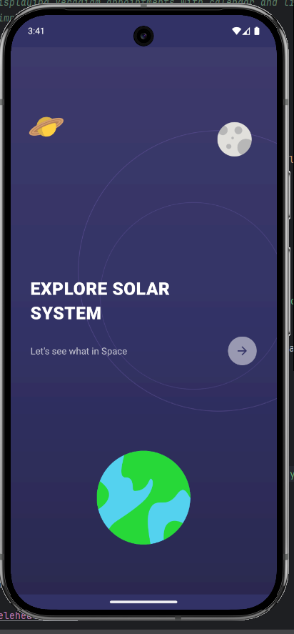
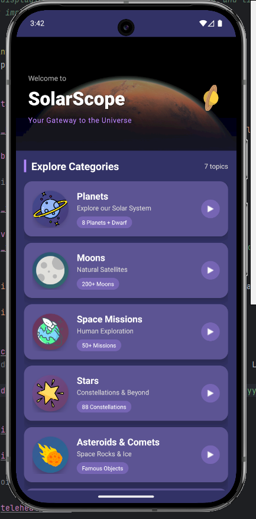
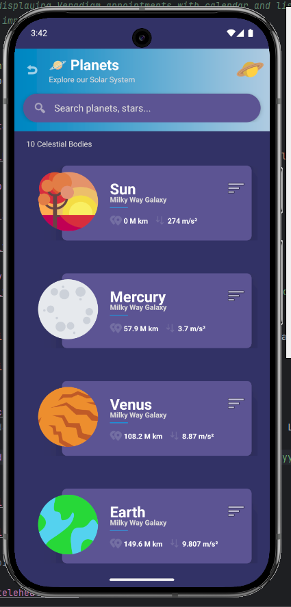
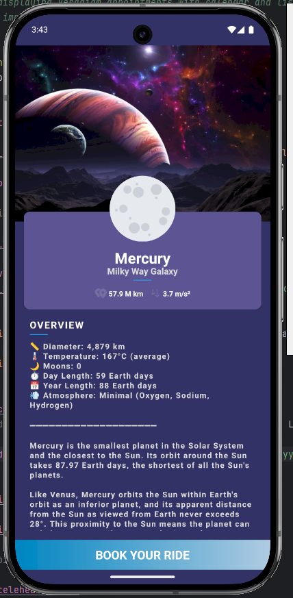
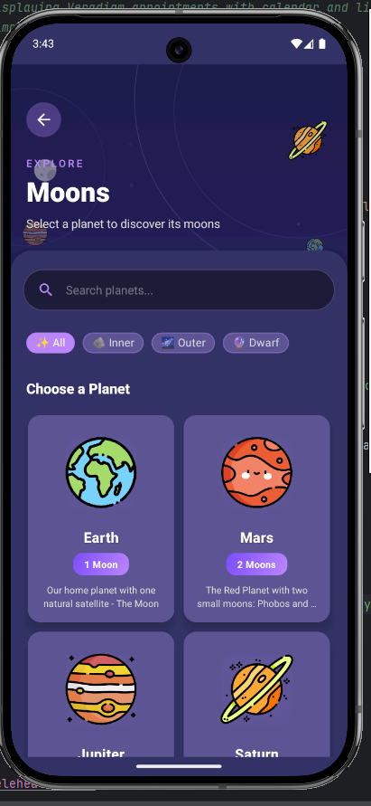
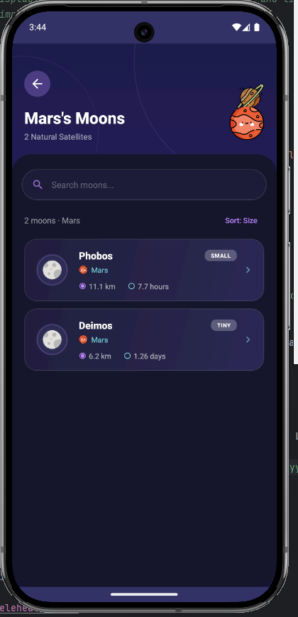
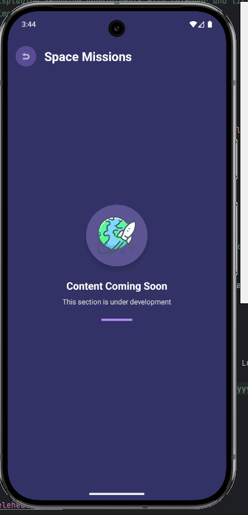

<p align="center">
  
</p>

<h1 align="center">🪐 Planetoo</h1>

<p align="center">
  <b>Your Ultimate Space Exploration Companion</b>
</p>

<p align="center">
  
  
  
  
</p>

<p align="center">
  
  
  
</p>

---

## 🌌 About The Project

**Planetoo** is a beautifully designed, feature-rich Android application that takes you on an immersive journey through our Solar System and beyond. Built with modern Android development practices, stunning UI/UX design, and real-time data from the Solar System OpenData API, Planetoo is your pocket encyclopedia for everything space.

Whether you're a student, educator, space enthusiast, or just curious about the cosmos, Planetoo brings the wonders of the universe right to your fingertips with stunning visuals, smooth animations, and comprehensive information.

---

## ✨ Features

### 🪐 **Explore Planets**
- Complete information on all 8 planets of our Solar System
- Detailed data including diameter, temperature, gravity, atmosphere
- Fun facts and educational content for each celestial body
- Beautiful high-quality images and gradients

### 🌙 **Discover Moons**
- **200+ Natural Satellites** from the Solar System
- Filter moons by their parent planet
- Real-time data fetched from **Solar System OpenData API**
- Comprehensive details: radius, gravity, orbital period, discovery info
- Advanced search and sorting capabilities

### 🚀 **Space Missions** *(Coming Soon)*
- Historic and ongoing space missions
- Mission timelines and achievements

### ⭐ **Stars & Constellations** *(Coming Soon)*
- 88 Constellations guide
- Star classification and facts

### ☄️ **Asteroids & Comets** *(Coming Soon)*
- Famous space rocks and ice objects
- Near-Earth object tracking

### 🌌 **Galaxies** *(Coming Soon)*
- Galaxy types and classifications
- The Milky Way and beyond

### 🧠 **Space Quiz** *(Coming Soon)*
- 100+ questions to test your knowledge
- Multiple difficulty levels

---

## 📱 Screenshots

<p align="center">
  <table>
    <tr>
      <td align="center"><b>Splash Screen</b></td>
      <td align="center"><b>Home Categories</b></td>
      <td align="center"><b>Planets List</b></td>
      <td align="center"><b>Planet Details</b></td>
    </tr>
    <tr>
      <td></td>
      <td></td>
      <td></td>
      <td></td>
    </tr>
    <tr>
      <td align="center"><b>Planet Selection</b></td>
      <td align="center"><b>Moons List</b></td>
      <td align="center"><b>Moon Details</b></td>
      <td align="center"><b>Coming Soon</b></td>
    </tr>
    <tr>
      <td></td>
      <td></td>
      <td></td>
      <td></td>
    </tr>
  </table>
</p>

---

## 🏗️ Architecture

Planetoo follows **Clean Architecture** principles with clear separation of concerns:

```
📦 com.example.planetapp
 ┣ 📂 data
 ┃ ┣ 📂 local          # Local data sources
 ┃ ┣ 📂 remote         # API services & models
 ┃ ┃ ┣ 📂 api          # Retrofit API interfaces
 ┃ ┃ ┣ 📂 mapper       # Data mappers
 ┃ ┃ ┗ 📂 model        # API response models
 ┃ ┗ 📂 repository     # Repository implementations
 ┣ 📂 domain
 ┃ ┣ 📂 model          # Domain entities
 ┃ ┣ 📂 repository     # Repository interfaces
 ┃ ┗ 📂 usecase        # Business logic use cases
 ┣ 📂 presentation
 ┃ ┣ 📂 adapter        # RecyclerView adapters
 ┃ ┣ 📂 splash         # Splash screen
 ┃ ┣ 📂 home           # Home/Categories screen
 ┃ ┣ 📂 planets        # Planets list
 ┃ ┣ 📂 detail         # Planet details
 ┃ ┣ 📂 moons          # Moons features
 ┃ ┗ 📂 category       # Category details
 ┗ 📂 utils            # Constants & utilities
```

---

## 🛠️ Tech Stack

| Technology | Purpose |
|------------|---------|
| **Kotlin** | Primary programming language |
| **View Binding** | Type-safe view access |
| **Coroutines** | Asynchronous programming |
| **Retrofit 2** | REST API client |
| **OkHttp** | HTTP client with logging |
| **Glide** | Image loading & caching |
| **Shimmer** | Loading placeholder effects |
| **Material Design 3** | Modern UI components |
| **SwipeRefreshLayout** | Pull-to-refresh functionality |

---

## 🔌 API Integration

Planetoo uses the **Solar System OpenData API** - a free, open-source API providing comprehensive data about celestial bodies in our Solar System.

```kotlin
interface SolarSystemApi {
    @GET("rest/bodies?filter[]=bodyType,eq,Moon")
    suspend fun getMoons(): Response<MoonListResponse>
    
    @GET("rest/bodies")
    suspend fun getPlanets(@Query("filter[]") filter: String): Response<MoonListResponse>
}
```

**Base URL:** `https://api.le-systeme-solaire.net/`

✅ No authentication required  
✅ Completely free  
✅ Reliable and up-to-date data

---

## 🎨 UI/UX Highlights

### 🌈 **Stunning Visuals**
- Custom gradient backgrounds
- High-quality planet and moon imagery
- Dark space-themed color palette

### 🎭 **Smooth Animations**
- Animated splash screen with floating elements
- Orbit path animations
- Entry animations with OvershootInterpolator
- Continuous rotation effects
- Staggered item animations in lists

### 📱 **Modern Design**
- Material Design 3 components
- Rounded corners and elevation
- Custom category cards with gradients
- Intuitive navigation hierarchy

---

## 🚀 Getting Started

### Prerequisites

- Android Studio Arctic Fox or later
- JDK 8 or higher
- Android SDK 34
- Minimum SDK 21 (Android 5.0)

### Installation

1. **Clone the repository**
   ```bash
   git clone https://github.com/yourusername/Planetoo.git
   ```

2. **Open in Android Studio**
   ```
   File → Open → Select the Planetoo folder
   ```

3. **Sync Gradle**
   ```
   Let Android Studio download all dependencies
   ```

4. **Run the app**
   ```
   Click the Run button or press Shift + F10
   ```

---

## 📦 Dependencies

```groovy
dependencies {
    // Core
    implementation 'androidx.core:core-ktx:1.7.0'
    implementation 'androidx.appcompat:appcompat:1.6.1'
    implementation 'com.google.android.material:material:1.9.0'
    implementation 'androidx.constraintlayout:constraintlayout:2.1.4'
    
    // Networking
    implementation 'com.squareup.retrofit2:retrofit:2.9.0'
    implementation 'com.squareup.retrofit2:converter-gson:2.9.0'
    implementation 'com.squareup.okhttp3:okhttp:4.11.0'
    implementation 'com.squareup.okhttp3:logging-interceptor:4.11.0'
    
    // Coroutines
    implementation 'org.jetbrains.kotlinx:kotlinx-coroutines-android:1.7.1'
    implementation 'androidx.lifecycle:lifecycle-runtime-ktx:2.6.2'
    
    // Image Loading
    implementation 'com.github.bumptech.glide:glide:4.16.0'
    
    // UI
    implementation 'com.facebook.shimmer:shimmer:0.5.0'
    implementation 'androidx.swiperefreshlayout:swiperefreshlayout:1.1.0'
}
```

---

## 🗺️ Roadmap

- [x] Splash Screen with animations
- [x] Home Categories
- [x] Planets listing & details
- [x] Moons exploration with API
- [x] Planet-specific moon filtering
- [x] Search & sort functionality
- [ ] Space Missions module
- [ ] Stars & Constellations
- [ ] Asteroids & Comets
- [ ] Galaxies exploration
- [ ] Interactive Space Quiz
- [ ] Favorites/Bookmarks
- [ ] Offline mode with Room DB
- [ ] Dark/Light theme toggle
- [ ] AR Planet viewer

---

## 🤝 Contributing

Contributions are what make the open-source community such an amazing place to learn, inspire, and create. Any contributions you make are **greatly appreciated**.

1. Fork the Project
2. Create your Feature Branch (`git checkout -b feature/AmazingFeature`)
3. Commit your Changes (`git commit -m 'Add some AmazingFeature'`)
4. Push to the Branch (`git push origin feature/AmazingFeature`)
5. Open a Pull Request

---

## 📄 License

Distributed under the MIT License. See `LICENSE` for more information.

---

## 👨‍💻 Author

**Junaid Jamshid**

- GitHub: [@junaidjamshid](https://github.com/junaidjamshid)

---

## 🙏 Acknowledgments

- [Solar System OpenData API](https://api.le-systeme-solaire.net/) - For providing free celestial data
- [NASA](https://www.nasa.gov/) - For space imagery inspiration
- [Material Design](https://material.io/) - For design guidelines
- [Shimmer](https://github.com/facebook/shimmer-android) - Facebook's loading effect library

---

<p align="center">
  <b>⭐ If you found this project useful, please consider giving it a star! ⭐</b>
</p>

<p align="center">
  Made with ❤️ and ☕ by Junaid Jamshid
</p>

<p align="center">
  
</p>
